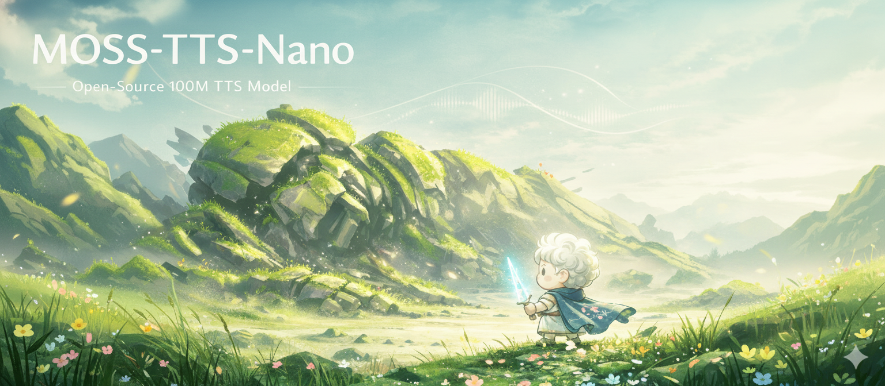

# MOSS-TTS-Nano

<br>

<p align="center">
  
  &nbsp;&nbsp;&nbsp;&nbsp;
  
</p>

<div align="center">
  <a href="https://clawhub.ai/luogao2333/moss-tts-voice"></a>
  <a href="https://huggingface.co/OpenMOSS-Team/MOSS-TTS-Nano"></a>
  <a href=" https://modelscope.cn/models/openmoss/MOSS-TTS-Nano"></a>
  <a href="https://mosi.cn/#models"></a>
  <a href="https://arxiv.org/abs/2603.18090"></a>

  <a href="https://studio.mosi.cn/experiments/moss-tts-nano"></a>
  <a href="https://studio.mosi.cn/docs/moss-tts-nano"></a>
  <a href="https://x.com/Open_MOSS"></a>
  <a href="https://discord.gg/Xf3aXddCjc"></a>
  <a href="./assets/images/wechat.jpg"></a>
</div>

[English](README.md) | [简体中文](README_zh.md)


MOSS-TTS-Nano is an open-source **multilingual tiny speech generation model** from [MOSI.AI](https://mosi.cn/#hero) and the [OpenMOSS team](https://www.open-moss.com/). With only **0.1B parameters**, it is designed for **realtime speech generation**, can run directly on **CPU without a GPU**, and keeps the deployment stack simple enough for local demos, web serving, and lightweight product integration.

[demo_video.mp4](https://github.com/user-attachments/assets/25aca215-0bd7-4d0c-be95-8d1f6737aec8)

## News

* 2026.4.10: We release **MOSS-TTS-Nano**. A demo Space is available at [OpenMOSS-Team/MOSS-TTS-Nano](https://huggingface.co/spaces/OpenMOSS-Team/MOSS-TTS-Nano). You can also view the demo and more details at [openmoss.github.io/MOSS-TTS-Nano-Demo/](https://openmoss.github.io/MOSS-TTS-Nano-Demo/).

## Demo

- Online Demo: [https://openmoss.github.io/MOSS-TTS-Nano-Demo/](https://openmoss.github.io/MOSS-TTS-Nano-Demo/)
- Hugging Face Space: [OpenMOSS-Team/MOSS-TTS-Nano](https://huggingface.co/spaces/OpenMOSS-Team/MOSS-TTS-Nano)

## Contents

- [News](#news)
- [Demo](#demo)
- [Introduction](#introduction)
  - [Main Features](#main-features)
- [Supported Languages](#supported-languages)
- [Quickstart](#quickstart)
  - [Environment Setup](#environment-setup)
  - [Voice Clone with `infer.py`](#voice-clone-with-inferpy)
  - [Local Web Demo with `app.py`](#local-web-demo-with-apppy)
  - [CLI Command: `moss-tts-nano generate`](#cli-command-moss-tts-nano-generate)
  - [CLI Command: `moss-tts-nano serve`](#cli-command-moss-tts-nano-serve)
- [MOSS-Audio-Tokenizer-Nano](#moss-audio-tokenizer-nano)
- [License](#license)
- [Citation](#citation)
- [Star History](#star-history)

## Introduction

<p align="center">
  
</p>

MOSS-TTS-Nano focuses on the part of TTS deployment that matters most in practice: **small footprint**, **low latency**, **good enough quality for realtime products**, and **simple local setup**. It uses a pure autoregressive **Audio Tokenizer + LLM** pipeline and keeps the inference workflow friendly for both terminal users and web-demo users.

### Main Features

- **Tiny model size**: only **0.1B parameters**
- **Native audio format**: **48 kHz**, **2-channel** output
- **Multilingual**: supports **Chinese, English, and more**
- **Pure autoregressive architecture**: built on **Audio Tokenizer + LLM**
- **Streaming inference**: low realtime latency and fast first audio
- **CPU friendly**: streaming generation can run on a **4-core CPU**
- **Long-text capable**: supports long input with automatic chunked voice cloning
- **Open-source deployment**: direct `python infer.py`, `python app.py`, and packaged CLI support

## Supported Languages

MOSS-TTS-Nano currently supports **20 languages**:

| Language | Code | Flag | Language | Code | Flag | Language | Code | Flag |
|---|---|---|---|---|---|---|---|---|
| Chinese | zh | 🇨🇳 | English | en | 🇺🇸 | German | de | 🇩🇪 |
| Spanish | es | 🇪🇸 | French | fr | 🇫🇷 | Japanese | ja | 🇯🇵 |
| Italian | it | 🇮🇹 | Hungarian | hu | 🇭🇺 | Korean | ko | 🇰🇷 |
| Russian | ru | 🇷🇺 | Persian (Farsi) | fa | 🇮🇷 | Arabic | ar | 🇸🇦 |
| Polish | pl | 🇵🇱 | Portuguese | pt | 🇵🇹 | Czech | cs | 🇨🇿 |
| Danish | da | 🇩🇰 | Swedish | sv | 🇸🇪 | Greek | el | 🇬🇷 |
| Turkish | tr | 🇹🇷 |  |  |  |  |  |  |

## Quickstart

### Environment Setup

We recommend a clean Python environment first, then installing the project in editable mode so the `moss-tts-nano` command becomes available locally.
The examples below intentionally keep arguments minimal and rely on the repository defaults.
By default, the code loads `OpenMOSS-Team/MOSS-TTS-Nano` and `OpenMOSS-Team/MOSS-Audio-Tokenizer-Nano`.

#### Using Conda

```bash
conda create -n moss-tts-nano python=3.12 -y
conda activate moss-tts-nano

git clone https://github.com/OpenMOSS/MOSS-TTS-Nano.git
cd MOSS-TTS-Nano

pip install -r requirements.txt
pip install -e .
```

If `WeTextProcessing` fails to install from `requirements.txt`, try installing it manually in the same environment:

```bash
conda install -c conda-forge pynini=2.1.6.post1 -y
pip install git+https://github.com/WhizZest/WeTextProcessing.git
```

### Voice Clone with `infer.py`

This repository keeps the direct Python entrypoint for local inference. The example below uses **voice clone mode**, which is the main recommended workflow for MOSS-TTS-Nano.

```bash
python infer.py \
  --prompt-audio-path assets/audio/zh_1.wav \
  --text "欢迎关注模思智能、上海创智学院与复旦大学自然语言处理实验室。"
```

This writes audio to `generated_audio/infer_output.wav` by default.

### Local Web Demo with `app.py`

You can launch the local FastAPI demo for browser-based testing:

```bash
python app.py
```

Then open `http://127.0.0.1:18083` in your browser.

### CLI Command: `moss-tts-nano generate`

After `pip install -e .`, you can call the packaged CLI directly:

```bash
moss-tts-nano generate \
  --prompt-speech assets/audio/zh_1.wav \
  --text "欢迎关注模思智能、上海创智学院与复旦大学自然语言处理实验室。"
```

Useful notes:

- `moss-tts-nano generate` writes to `generated_audio/moss_tts_nano_output.wav` by default.
- `--prompt-speech` is the friendly alias for the reference audio path used by voice cloning.
- `--text-file` is supported for long-form synthesis.

### CLI Command: `moss-tts-nano serve`

You can also launch the web demo through the packaged CLI:

```bash
moss-tts-nano serve
```

This command forwards to `app.py`, keeps the model loaded in memory, and serves the local browser demo plus HTTP generation endpoints.

## MOSS-Audio-Tokenizer-Nano

<a id="mat-intro"></a>
### Introduction
**MOSS-Audio-Tokenizer** is the unified discrete audio interface for the entire MOSS-TTS family. It is built on the **Cat** (**C**ausal **A**udio **T**okenizer with **T**ransformer) architecture, a CNN-free audio tokenizer composed entirely of causal Transformer blocks. It serves as the shared audio backbone for MOSS-TTS, MOSS-TTS-Nano, MOSS-TTSD, MOSS-VoiceGenerator, MOSS-SoundEffect, and MOSS-TTS-Realtime, providing a consistent audio representation across the full product family.

To further improve perceptual quality while reducing inference cost, we trained **MOSS-Audio-Tokenizer-Nano**, a lightweight tokenizer with approximately **20 million parameters** designed for high-fidelity audio compression. It supports **48 kHz** input and output as well as **stereo audio**, which helps reduce compression loss and improve listening quality. It can compress **48 kHz stereo audio** into a **12.5 Hz** token stream and uses **RVQ with 16 codebooks**, enabling high-fidelity reconstruction across variable bitrates from **0.125 kbps to 2 kbps**.


To learn more about setup, advanced usage, and evaluation metrics, please visit the [MOSS-Audio-Tokenizer Repository](https://github.com/OpenMOSS/MOSS-Audio-Tokenizer)

<p align="center">
  
  Architecture of MOSS-Audio-Tokenizer-Nano
</p>

### Model Weights

| Model | Hugging Face | ModelScope |
|:-----:|:------------:|:----------:|
| **MOSS-Audio-Tokenizer-Nano** | [](https://huggingface.co/OpenMOSS-Team/MOSS-Audio-Tokenizer-Nano) | [](https://modelscope.cn/models/openmoss/MOSS-Audio-Tokenizer-Nano) |


## License

This repository will follow the license specified in the root `LICENSE` file. If you are reading this before that file is published, please treat the repository as **not yet licensed for redistribution**.

## Citation

If you use the MOSS-TTS work in your research or product, please cite:

```bibtex
@misc{openmoss2026mossttsnano,
  title={MOSS-TTS-Nano},
  author={OpenMOSS Team},
  year={2026},
  howpublished={GitHub repository},
  url={https://github.com/OpenMOSS/MOSS-TTS-Nano}
}
```

```bibtex
@misc{gong2026mossttstechnicalreport,
  title={MOSS-TTS Technical Report},
  author={Yitian Gong and Botian Jiang and Yiwei Zhao and Yucheng Yuan and Kuangwei Chen and Yaozhou Jiang and Cheng Chang and Dong Hong and Mingshu Chen and Ruixiao Li and Yiyang Zhang and Yang Gao and Hanfu Chen and Ke Chen and Songlin Wang and Xiaogui Yang and Yuqian Zhang and Kexin Huang and ZhengYuan Lin and Kang Yu and Ziqi Chen and Jin Wang and Zhaoye Fei and Qinyuan Cheng and Shimin Li and Xipeng Qiu},
  year={2026},
  eprint={2603.18090},
  archivePrefix={arXiv},
  primaryClass={cs.SD},
  url={https://arxiv.org/abs/2603.18090}
}
```

```bibtex
@misc{gong2026mossaudiotokenizerscalingaudiotokenizers,
  title={MOSS-Audio-Tokenizer: Scaling Audio Tokenizers for Future Audio Foundation Models}, 
  author={Yitian Gong and Kuangwei Chen and Zhaoye Fei and Xiaogui Yang and Ke Chen and Yang Wang and Kexin Huang and Mingshu Chen and Ruixiao Li and Qingyuan Cheng and Shimin Li and Xipeng Qiu},
  year={2026},
  eprint={2602.10934},
  archivePrefix={arXiv},
  primaryClass={cs.SD},
  url={https://arxiv.org/abs/2602.10934}, 
}
```

## Star History

[](https://star-history.com/#OpenMOSS/MOSS-TTS-Nano&Date)
